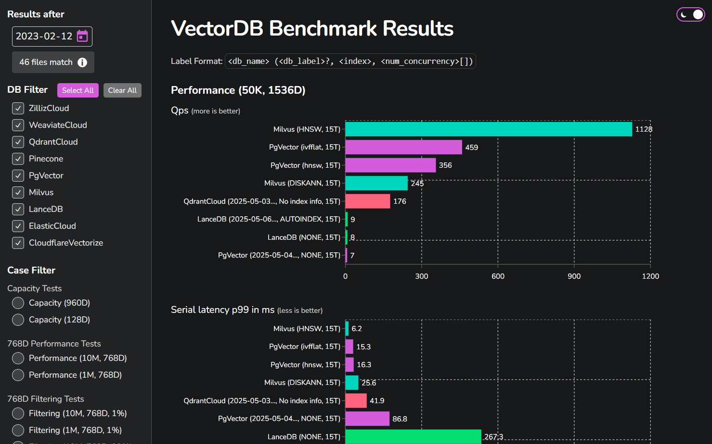

# vddb-ui

A simple UI for rendering [VectorDBBench](https://github.com/zilliztech/VectorDBBench) results. (Prints well, so that charts can be shared easily via PDF.)

## How to use

1. Clone.
2. `pnpm install`
3. Point to your VectorDBBench results directory in the `.env` file. (Something like `RESULTS_PATH=<clone location>\vectordb_bench\results`)
4. `pnpm dev`

## Note

**95% of this code was generated and I didn't have the time to properly validate and improve it as I normally would.** There's especially something weird going on when rendering larger amounts of data (bad performance).

## Why?

VectorDBBench has a UI included, so why not just use that?

- I experienced crashes: https://github.com/zilliztech/VectorDBBench/issues/512
- But also... I got a bit frustrated with the fact that filters aren't persisted in local storage and when looking at the changes to the streamlit code that AI suggested to achieve that, I figured creating this from scratch would be easier. 😄
- (I've been looking for an excuse to try out waku. ☺️)
